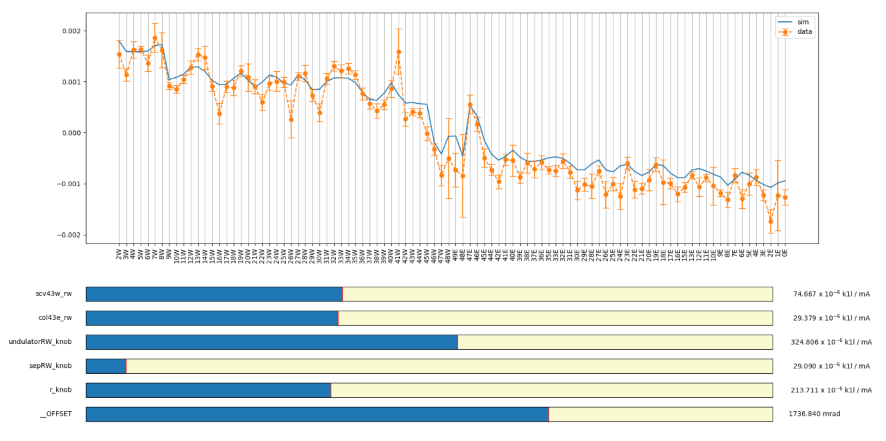

# InteractiveImpedanceFitter
Fit data to detector-to-detector phase advance using scipy optimizers and an interactive matplotlib front end.  Python calls Bmad library through ctypes.

Each tick along the horizontal axis is a beam position detector.  At each detector, the frequency and phase of the beam is measured.  The beam is measured twice, once with low current and once with high current.  The data points are the mean over several 10s of measurements of the difference in the phase advance of the low and high current beams.  The error bars are the uncertainty.

The blue bars are the strength of the impedance at the expected strongest impedance sources in the machine.  The impedance is in units k1/mA, or in other words, focusing per beam current.  Higher beam current yields a stronger focusing effect from the particular impedance source.

The best result was found by adjusting the impedances manually using the front end, then using a local optimizer to refine the result.

Conference publication at https://accelconf.web.cern.ch/ipac2018/papers/thpaf020.pdf

